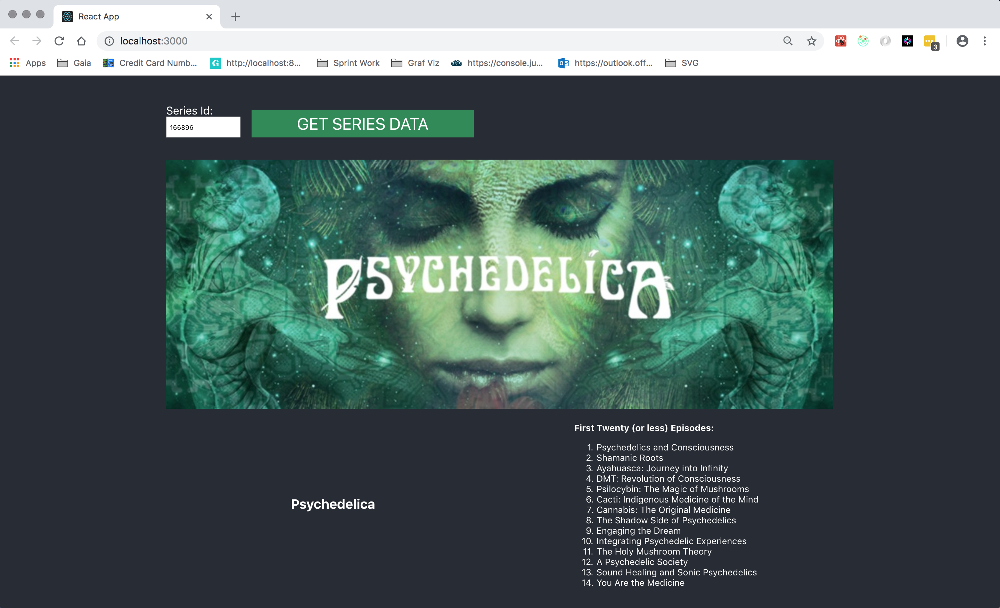
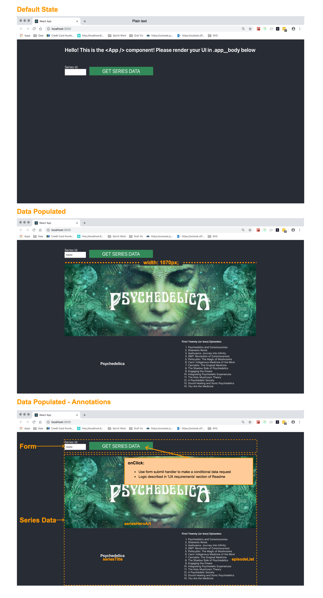
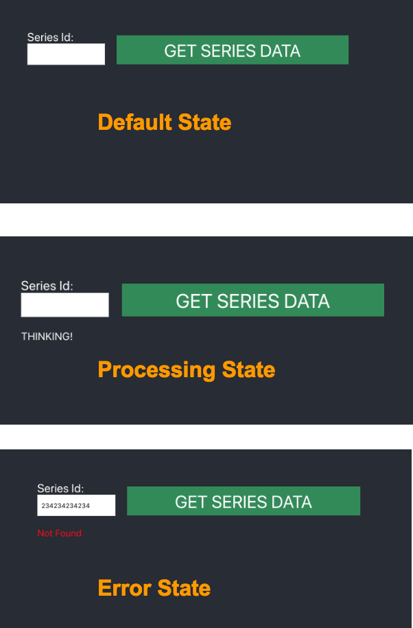

This project was bootstrapped with [Create React App](https://github.com/facebook/create-react-app).

## Full Stack Developer Challenge

### Summary

* In this challenge you are tasked with allowing a user to visualize data for a Gaia series
* There are 2 main pieces of functionality:
  1. Implement an Express server route handler to request and transform data from multiple public Gaia content endpoints
  1. Implement a form in React (input and button) which takes `seriesId` as an input and fetches data for that series
* The final data will represent a series and up to 20 of its episodes
* All challenge requirements can be found in the [Acceptance Criteria Section](#acceptance-criteria)
  * Please complete as many of the requirements as you can within the suggested timebox (2-3 hrs)
  * Emphasize functionality **more** than polish/code quality

### Contents
<!--ts-->
* [Pre-requisites](#pre-requisites)
* [Running the project](#running-the-project)
* [Orienting yourself](#orienting-yourself)
* [Guidelines](#guidelines)
* [Acceptance Criteria](#acceptance-criteria)
* [Mocks](#mocks)
* [What is being tested for](#what-is-being-tested-for)
<!--te-->

### Pre-requisites
1. npm >= v5.2
   * Other package managers can be used so long as they are supported by `Create-React-App`
1. Nodejs >= v8.x
1. Two open terminals at the root of the application

### Running the project
1. From a terminal, run `$ npm install` to install dependencies.
1. Run `$ npm start` to start the React application.
1. In the other terminal, run `$ npm run server` to run an Express server on port: 9001
1. View the running web app in your browser by navigating to `http://localhost:3000`.

### Orienting yourself
* Once the project is running, open the codebase in your editor of choice
* There are two files that will serve as the starting point
  * `/src/App.js`
  * `/src/server/index.js`
* Find the `TODO` comments in these files

### Guidelines
1. Install and use **any** packages/libraries you wish.
1. Add any folders and files you may need to organize your code.
1. Try to timebox no more than 2-3 hours for this exercise. 

### Acceptance Criteria
1. Implement a simple form using React that accepts a numeric id value. This id corresponds to one of Gaia's original video series (`seriesId`).
   * Sample test values:
     1. `122881`
     1. `179166`
     1. `166896`
   * On form submit - pass `seriesId` with an http request to the local Express server.
1. Implement a route handler in the local Express server that:
   * Uses the `seriesId` included on the incoming http request to proxy another external http request to Gaia content API's.
   * Process and transform response data and serve it back to the original request (response schema below).
   * Handle and pass along any errors
1. When receiving a successful, and well-formed response from the Express server, the web app should render the following:
   * The hero artwork for the series.
   * The title for the series.
   * An ordered list of episode titles in ascending order.

_UX and layout requirements are detailed below._

#### Starting Points:
1. Express Server
   * Open `/src/server/index.js`
     * **Notice the two constants in the file:**
       1. `exampleNodeData`
       1. `exampleSeriesEpisodeData`
   * Implement an endpoint handler for `/series-videos` that:
     1. Fetches node data > http GET request to `https://brooklyn.gaia.com/node/[:nodeId]`
        * Data from this endpoint will look like `exampleNodeData`
        * Datapoints to use:
          * Series hero art -- `exampleNodeData.hero_image.hero_1070x400`
          * Series title -- `exampleNodeData.title`
     1. Fetches Episode data > http GET request to `https://brooklyn.gaia.com/v2/videos/series/[:seriesId]`
        * Data from this endpoint will be an array of `exampleSeriesEpisodeData`
        * The route is paginated (please do **NOT** implement pagination)
          * The endpoint will return up to 20 episodes by default (use these)
        * Datapoints to use:
          * Episode Title -- `episode.title`
          * Episode number -- `episode.episode`
        * Iterate over the raw array of `exampleSeriesEpisodeData` and create an array of `basicEpisode`:
          ```js
          const basicEpisode = {
            episodeTitle: exampleSeriesEpisodeData.title,
            episodeNumber: exampleSeriesEpisodeData.episode,
          }
          ```
      1. Finally, return data in the form:
         ```js
         {
           seriesHeroArt: string,
           seriesTitle: string,
           episodeList: [ ..., { basicEpisode }, ... ],
         }
         ```
      1. Implement Catch logic to return meaningful errors to your client

1. React Application
   * **UI requirements:**
     * Responsive - **NO**
     * Content container - `width: 1070px;`
     * Form:
       * Label and button text are defined in the mock
       * Build to the mocks using your best estimation
     * Series data container:
       * Build to the mocks using your best estimation
   * **UX Requirements:**
     * Form `onSubmit`
       * Should:
         * make a request for series data using the `seriesId` provided by the user (valid `seriesId`'s in [Acceptance Criteria](#acceptance-criteria)
         * display processing/loading message while an http request is in transit
         * display any error messaging should an http request fail
       * Should not attempt to make a request if:
         * The input is empty
         * The app is already displaying data for the current `seriesId` form value
         * The user tries to use any non-numeric value for `seriesId`
         * There is already a request processing
     * [Form states](#form-states):
       * Processing - any time an http request is triggered by the form
         * Use a clear visual indicator that the application is processing a request
         * A simple 'Thinking' string is sufficient
       * Error - If the request returns an error
         * Use a clear visual indicator that the last request failed
         * A generic 'Request Failed' message is sufficient
           * Simple way to trigger errors - send an invalid `seriesId` (ex: `12938635498612349`)

### Mocks
#### Default View

#### Form States


### What is being tested for
  * Does the solution satisfy the acceptance criteria?
  * React:
    * Effective and consistent state management
    * Requesting data and handling response
    * Understanding of React lifecycle
    * Well-defined component Structure
    * Concise CSS
  * Express Server:
    * Concurrent http requests
    * Manipulating data
    * Basic error handling
  * Confidence in solution accuracy
